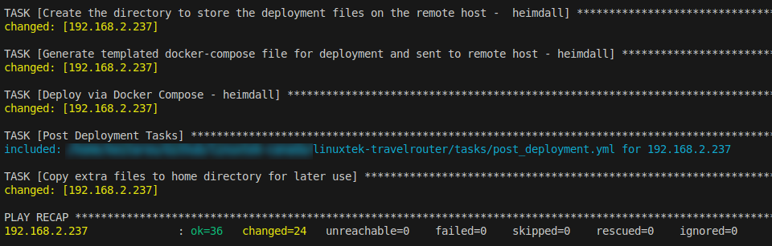

# linuxtek-travelrouter


Details and configuration for LinuxTek TravelRouter build.

## Introduction

Travel Routers have been growing in popularity as a way of sharing one internet conenction, securing multiple devices, being able to share files, and run useful services.

For example, the [GL.iNet](https://www.gl-inet.com/products/) products have a number of consumer options which are compact and popular.


However this would require travelling with multiple devices such as a Mini PC, networking cables, etc.

Instead, a Raspberry Pi could be used as a travel router, while also providing services.

## Hardware

* See the [hardware docs](docs/hardware.md) for more details on the hardware used in the build.
* See the [consideration-notes](docs/consideration-notes.md) for more details on the thought process behind the hardware choices.

As this travel router will be running active services and processes, frequent writes to disk may shorten the lifespan of a MicroSD card.  An NVMe disk using a Raspberry Pi hat is recommended for more durable storage.  The MicroSD slot can be used for additional removeable storage, such as media.

## Software

There are multiple software packages that can be useful in this situation. Ideally, all installation is done using Docker for modularity and easy updates.  K3s was considered but would add resource overhead.

This repo build includes the following software to be deployed using Docker Compose:

* RaspAP - Debian based wireless router software - [Website](https://raspap.com/)
* Jellyfin - Free Software Media System - [Website](https://jellyfin.org/)
* PiHole - Network-wide Ad Blocking - [Website](https://pi-hole.net/)
* Portainer - Container Management Software - [Website](https://www.portainer.io/)
* Heimdall - Application Dashboard - [Website](https://heimdall.site/)

## Raspberry Pi Preparation

The installation is automated to run using Ansible against the base OS image, ideally Raspberry Pi OS with Desktop. You will need to have a running Raspberry Pi on the MicroSD card.  If you will be switching to boot off an attached NVMe drive, additional configuration will be needed, and then the same image will need to be downloaded and flashed onto the NVMe drive to boot from.

1.  Use the [Raspberry Pi Imager](https://www.raspberrypi.com/software/) to burn the latest image to a MicroSD card. The *Raspberry Pi OS with Desktop and Recommended Software* is suggested as a base starting point. For Raspberry Pi 5, be sure to download the 64-bit version of the image.

2. Perform OS Customization.  

Click "Edit Settings" and set the following options:

* Set username and password:
  - Username: sysadmin
  - Password: changeme
* Set Locale Settings:
  - Time Zone: Your Time Zone
  - Keyboard Layout: US
* Services:
  - Enable SSH
  - Allow public-key authentication only
  - Include a public SSH key and set authorized_keys for sysadmin

Click "Save", and then click "Yes" to apply the OS customization settings.

Write the customized image to the MicroSD card, boot the Raspberry Pi, and access the GUI. 

Alternatively, if you set up SSH access and can get the DHCP IP address of the Raspberry Pi, you can SSH in for the next steps.

3.  Enable PCI Express

Note: Instructions are based on [Jeff Geerling's article](https://www.jeffgeerling.com/blog/2023/nvme-ssd-boot-raspberry-pi-5)

To enable the PCI Express port with Gen3 speeds, edit `/boot/firmware/config.txt` and add the following at the bottom:

```
# Add to bottom of /boot/firmware/config.txt
dtparam=pciex1

# Note: You could also just add the following (it is an alias to the above line)
# dtparam=nvme

# Optionally, you can control the PCIe lane speed using this parameter
dtparam=pciex1_gen=3
```
4. Enable NVMe Boot

Adjust the BOOT_ORDER value in the Raspberry Pi Bootloader configuration:

* Open the Raspberry Pi configuration editor: `sudo raspi-config`
* Navigate to `Advanced Options > Boot > Boot Order`
* Highlight `NVMe/USB Boot` and press Enter
* Follow the prompts to save the configuration

Reboot the Raspberry Pi 5 for the settings to take effect.

5. Clone the Raspberry Pi OS installation from the MicroSD to NVMe

Check that the NVMe drive is detected by running `lsblk`.   You should see a disk similar to `nvme0n1`.

Run the following commands to download and install the rpi-clone maintained by Jeff, and clone the install:

```
# Create a Github directory and access it
mkdir ~/Github
cd ~/Github

# Install rpi-clone.
git clone https://github.com/geerlingguy/rpi-clone.git
cd rpi-clone
sudo cp rpi-clone rpi-clone-setup /usr/local/sbin

# Clone to the NVMe drive (usually nvme0n1, but check with `lsblk`).
sudo rpi-clone nvme0n1
```

Once complete, shut down the Raspberry Pi, and remove the MicroSD card.

6.  Boot the Raspberry Pi and confirm the main drive is NVMe.  This can be confirmed with `lsblk`.

7. Run raspi-config to set Country value (if not already set).

By default, Wi-Fi will be soft blocked by rfkill, until a country code is set.  You can confirm this by running `rfkill list`. See[this forum post](https://forums.raspberrypi.com/viewtopic.php?t=379975) for reference.

To fix this, run `sudo raspi-config`, go to Localization Options > WLAN Country, and set the correct country code.  Reboot, and check `rfkill list` again to ensure Wi-Fi is enabled.


8.  Install prerequisites

To run the Ansible Playbook customize the Raspberry Pi OS, prerequisites including Python 3 will need to be installed.  In addition, this is a good time to perform a general update.  Run the following commands:

```
sudo apt update
sudo apt full-upgrade
sudo apt install -y curl git htop python3 vim wget
```
Once this is complete, reboot the Raspberry Pi again so you can boot with the updated kernel. Based on the [Raspberry Pi Documentation](https://www.raspberrypi.com/documentation/computers/linux_kernel.html), the [usual update process](https://www.raspberrypi.com/documentation/computers/os.html#update-software) automatically updates your kernel to the latest stable release.

## Repo Usage

With a booted Raspberry Pi 5, knowing the IP address of the device, follow these steps on your workstation:

1. Ensure you have Ansible and the prerequisites installed on your workstation.  Follow the [Installation Documentation](https://docs.ansible.com/ansible/latest/installation_guide/intro_installation.html) for the best installation method for your system.

2. Clone this Github repository: `git clone https://github.com/linuxtek-canada/linuxtek-travelrouter.git` and access it: `cd linuxtek-travelrouter`.

3. Create a `.env` file in the repo directory based on the `env-sample` file, and enter in all your values. You can copy or rename the `env-sample` file.

4. Create an `inventory` file, and add the IP address of the Raspberry Pi.

5. Adjust the `ansible.cfg` file if you have any custom settings needed to run Ansible. See the [Ansible Configuration Settings](https://docs.ansible.com/ansible/latest/reference_appendices/config.html) documentation page for more details.

6. Adjust the playbook.yml file and remove any values under "container_names" that you don't want to be installed into your system.

7.  Run the following command to run Ansible to connect to the Raspberry Pi and install all the software:

`ansible-playbook -i inventory playbook.yml`

Then get a beverage and wait. Once completed, you should be returned to your command prompt with a recap similar to this:



You may want to reboot the Raspberry Pi again for good measure.

## Accessing Services

Booting up the Raspberry Pi with the additional Wi-Fi dongle attached, you should see your set Wi-Fi SSID that was configured in the .env file, and you should be able to connect.

From there, access `http://raspap.local` to configure the RaspAP web interface.